# 🛡️ SentinelGrid AI

### **AI-Powered Cyber Resilience Platform for Critical National Infrastructure**

[](#)
[](#)
[](#)
[](#)
[](#)
[](#)

---

## 🚨 Problem Statement

India's critical national infrastructure is under sustained attack — and the defence gap is widening.

**The numbers are alarming:**
- CERT-In handled **1.59 million cybersecurity incidents in 2023**, a figure that has continued climbing through 2024–25.
- **AIIMS Delhi** was paralysed for over two weeks by ransomware in 2022.
- **CBSE suffered a data breach** in 2024 affecting examination records.
- In **early 2026**, a coordinated cyberattack hit CBSE's digital infrastructure ahead of board examinations — compromising student data and forcing emergency shutdowns across multiple states.
- Over **70% of government entities operate on end-of-life IT infrastructure**, giving attackers ready entry points.

**The deeper problem is detection speed.** Most public-sector organisations discover breaches only after significant damage has already occurred — weeks or months after initial infiltration. Advanced Persistent Threats (APTs) deliberately operate at low-and-slow speeds, specifically designed to evade signature-based detection.

> By the time a signature exists, the attack has already succeeded somewhere.

What is needed is a **behavioural intelligence layer** that detects anomalies from how systems *normally behave* — not from whether they match a known malware signature — across both IT and OT environments.

**SentinelGrid AI** compresses the time from initial compromise to detection and response from **weeks to hours**.

---

## 💡 Innovation Highlights

SentinelGrid AI goes beyond traditional SIEM and SOC platforms by combining capabilities that are typically siloed across multiple enterprise products:

| Capability | What Makes It Different |
|---|---|
| **Behavioural Anomaly Detection** | Per-entity baselines for users, devices, and network segments — no signatures required |
| **APT Campaign Attribution** | MITRE ATT&CK TTP mapping with threat actor similarity scoring and next-stage prediction |
| **Autonomous Response Orchestrator** | Executes pre-approved containment within seconds; human escalation gates for high blast-radius actions |
| **Vulnerability Prioritisation** | Contextualises CVEs against your specific network topology and observed threat actor profiles |
| **Cyber Resilience Digital Twin** | Attack path modelling and red team scenario testing without touching live systems |
| **Threat Intelligence RAG** | Air-gapped semantic search over CVEs and OWASP — offline, no cloud dependency |
| **Lateral Movement Detection** | Topology-aware attack path propagation modelling across IT and OT segments |
| **Executive Dashboard** | MTTD/MTTR metrics and business risk impact in plain language for leadership |

> The platform shifts cybersecurity from **reactive detection** to **predictive cyber resilience**.

---

## 🎬 End-to-End Demo Flow

> **Detect → Attribute → Predict → Simulate → Respond**

1. **Ingest** — Security telemetry from edge sensors, network flows, logs, and OT/IT endpoints enters the platform
2. **Detect** — UEBA engine scores behavioural deviations against per-entity baselines; no signatures needed
3. **Attribute** — MITRE ATT&CK engine maps observed patterns to known APT TTPs and technique signatures
4. **Predict** — Attack Prediction engine forecasts the attacker's likely next-stage moves before they execute
5. **Simulate** — Digital Twin models attack propagation and blast radius across your actual infrastructure graph
6. **Explain** — Threat Intelligence RAG answers *why* this matters using CVEs and OWASP sources
7. **Respond** — Response Orchestrator generates, simulates, and executes containment actions within seconds
8. **Escalate** — Human escalation gates trigger for actions above defined blast-radius thresholds
9. **Report** — Executive Dashboard shows MTTD/MTTR improvement and business impact in real time

---

## 📸 Platform Showcases (Working Features)

### 1. 🌐 Geopolitical Threat Origin Map
Visualize global APT campaigns and pinpoint where attacks are originating in real-time.
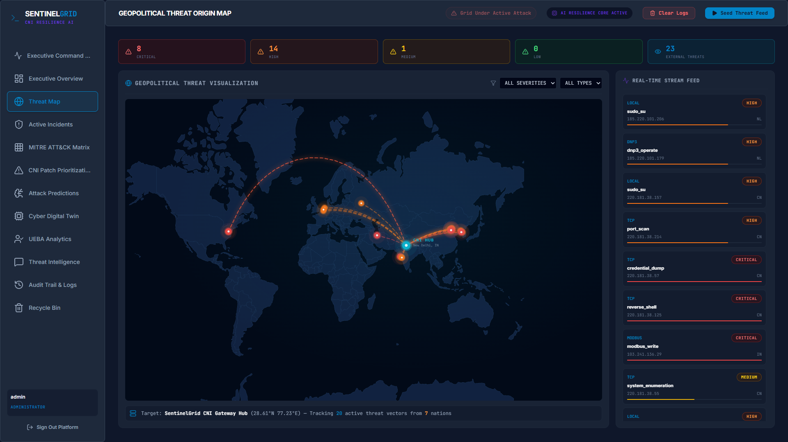

### 2. 🛡️ Active Security Incidents & Autonomous Response
Manage all active incidents in a unified queue. The **Autonomous Response Orchestrator** executes pre-approved containment within seconds, while requiring human escalation for high blast-radius actions.
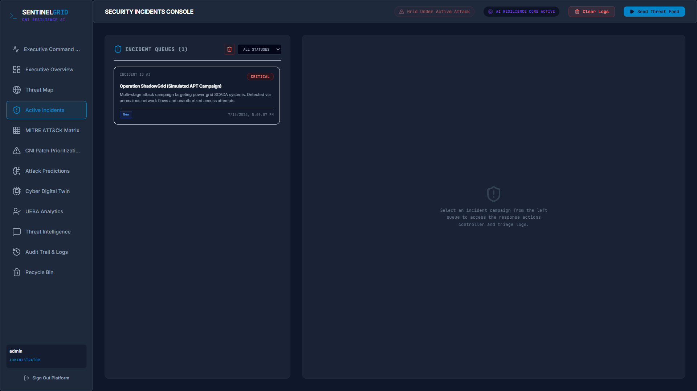

### 3. 🧩 MITRE ATT&CK Matrix Mapping
Automatically maps observed behaviors to the MITRE ATT&CK framework, predicting the next stage of an APT campaign.
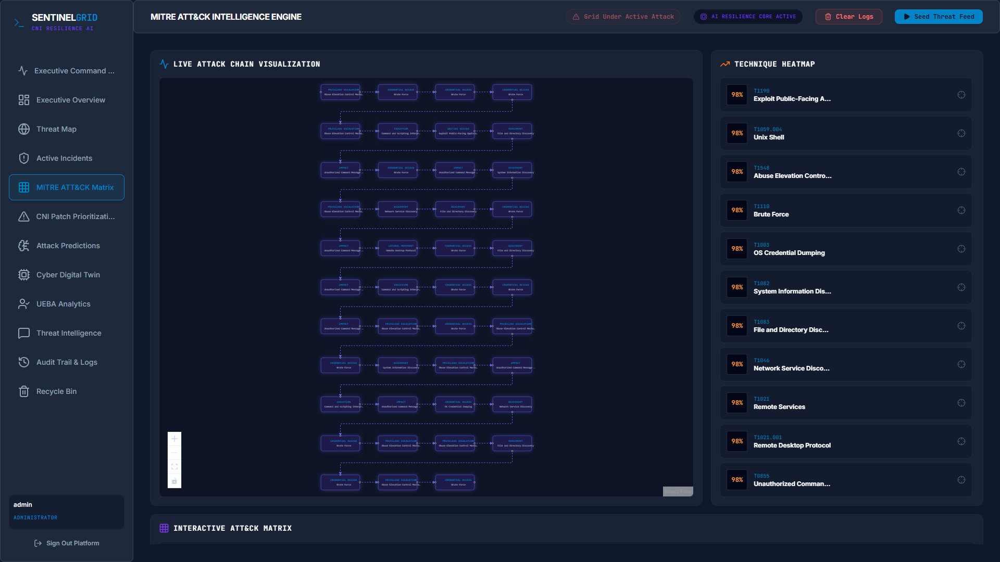

### 4. 🔮 Cyber Digital Twin & Blast Radius Simulation
Test attack path modeling and red team scenarios without touching live systems. Simulate the blast radius of containment actions before executing them.
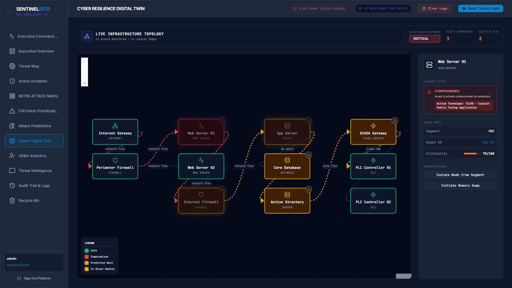

### 5. ⚠️ CNI Patch Prioritization
Contextualizes CVEs against your specific network topology and observed threat actor profiles, highlighting the most critical vulnerabilities.
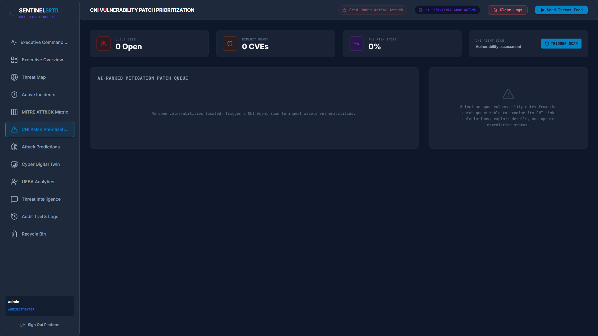

### 6. 🧠 Attack Predictions & UEBA Analytics
Utilizes User and Entity Behavior Analytics (UEBA) to detect anomalies. Machine learning models predict future attack vectors based on historical telemetry.
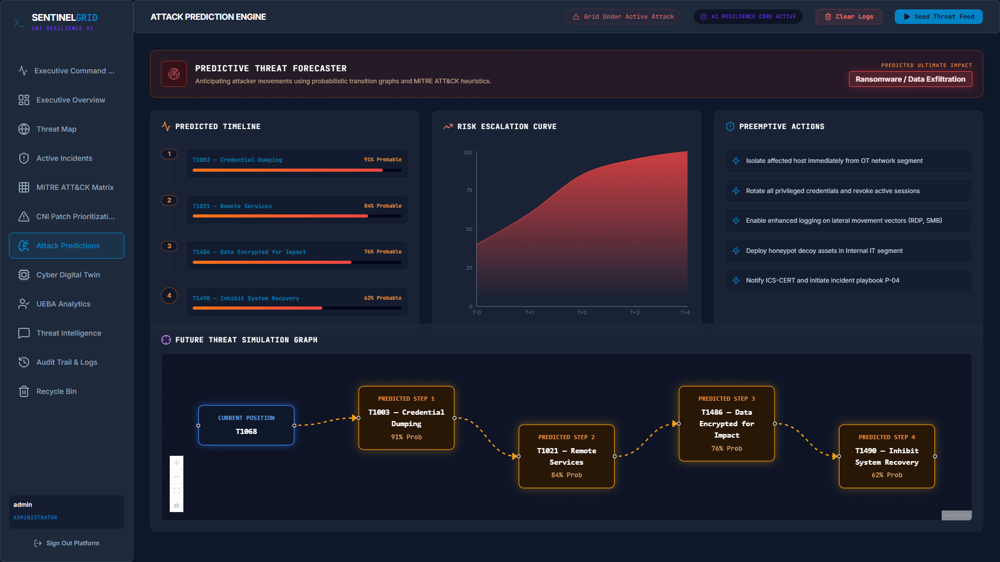
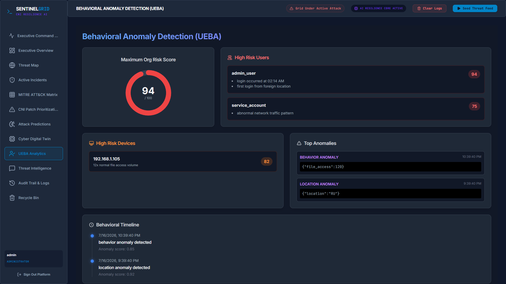

### 7. 🕵️ Threat Intelligence RAG
An integrated semantic search engine for threat intelligence. Ask questions about CVEs, APTs, and get actionable insights.
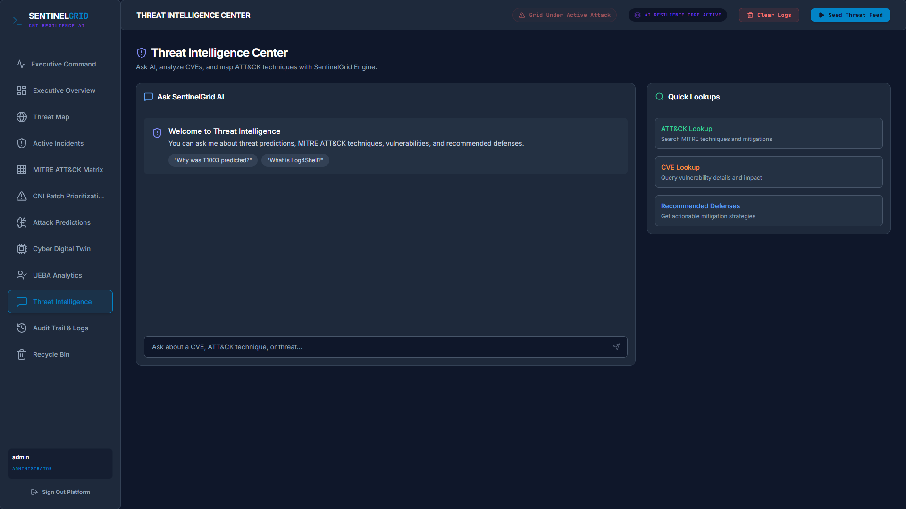

---

## 📊 Evaluation Metrics

Directly addressing the judging evaluation criteria:

| Metric | SentinelGrid AI |
|---|---|
| **Anomaly Detection Rate** | Ensemble Isolation Forest + OC-SVM with tunable sensitivity |
| **False Positive Rate** | Per-entity dynamic baselines reduce noise vs. static thresholds |
| **APT Attribution Accuracy** | Technique-level MITRE ATT&CK mapping (T-code precision) |
| **Playbook Automation Coverage** | `isolate_host`, `reset_credentials`, `block_ip`, `rotate_secrets`, `notify_soc` |
| **MTTD/MTTR Improvement** | Compresses detection from weeks → hours; response from hours → seconds |
| **Action Auditability** | Every automated action logged with timestamp, actor, confidence, and simulation result |

---

## ⚙️ System Architecture

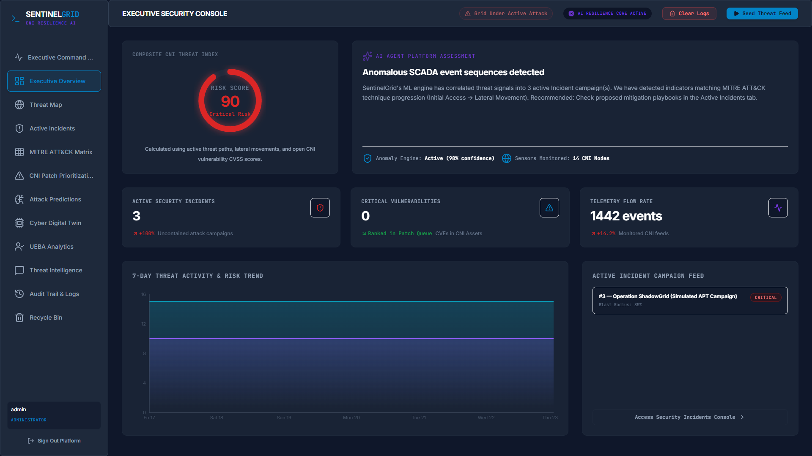

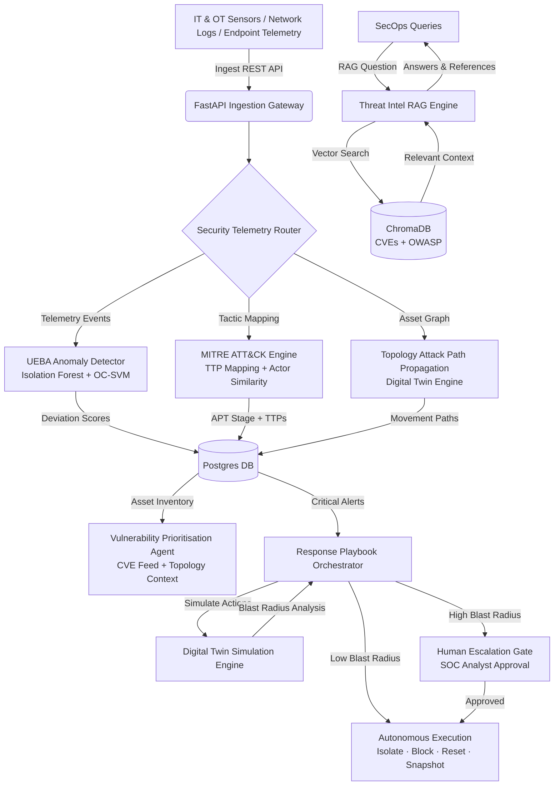

---

## 🏛️ Core Architectural Pillars

1. **Behavioural Anomaly Detection (UEBA)**
   - Ensemble of **Isolation Forest** and **One-Class SVM** — zero signature dependency.
   - Builds per-entity (user, server, network segment) baseline profiles from historical behaviour.
   - Continuously scores deviations across log data, network flows, and endpoint telemetry.
   - **Risk Scorer** and **Explanation Engine** translate anomalies into plain-English analyst rationales.
   - Risk surfaced as `Low / Medium / High / Critical` with a 0–100 score.

2. **APT Campaign Attribution & Prediction**
   - Maps observed attack patterns to MITRE ATT&CK tactics and techniques (T-code precision).
   - Threat actor similarity scoring against known APT groups: APT28, APT29, APT41, Lazarus, Sandworm, TRITON, Dragonfly, MuddyWater.
   - Predicts likely next-stage moves using Markov chain tactic transition probabilities.
   - Generates defensive actions tailored to the organisation's specific architecture.

3. **Topology-Aware Lateral Movement Detection**
   - Digital Twin models the infrastructure as a node-edge graph (ReactFlow + backend topology).
   - Identifies attack propagation paths and choke points across IT and OT segments.
   - Detects abnormal inter-asset communication patterns and visualises blast radius in real time.

4. **Autonomous Incident Response Orchestrator**
   - Executes pre-approved containment playbooks within seconds of high-confidence threat confirmation.
   - Supported actions: `isolate_host`, `reset_credentials`, `block_external_ip`, `rotate_secrets`, `notify_soc_team`.
   - **Human escalation gates** automatically trigger for high-severity incidents.
   - Full simulation run before any action is committed — side effects, reversibility, and affected systems shown upfront.

5. **Government Infrastructure Vulnerability Prioritisation**
   - Continuously maps asset inventory against live CVE feeds.
   - Contextualises exploitability using network topology and observed threat actor profiles.
   - Generates a dynamic, risk-ranked remediation queue — because government teams cannot patch everything at once.

6. **Cyber Resilience Digital Twin**
   - AI-generated simulation of the organisation's security architecture.
   - Enables attack path modelling, red team scenario testing, and investment impact assessment.
   - All simulation runs against a virtual replica — live production systems are never touched.

7. **Threat Intelligence RAG Engine**
   - Semantic query interface backed by **ChromaDB**.
   - Sources: CVE database and OWASP threat intelligence.
   - Custom offline `SimpleLocalEmbeddingFunction` (`sentence-transformers`) for air-gapped deployments.
   - Returns answers with source attribution for every query.

---

## 🚀 How to Start the Project (Local Development)

The project consists of a FastAPI Python backend and a React/Vite frontend. It uses SQLite for local development out of the box.

### Prerequisites
- Python 3.11+
- Node.js 18+ & npm

### 1. Backend Setup (FastAPI)
1. Open a terminal and navigate to the `backend` directory:
   ```bash
   cd backend
   ```
2. Create and activate a Python virtual environment:
   ```bash
   python -m venv .venv
   # Windows
   .venv\Scripts\activate
   # Linux/Mac
   source .venv/bin/activate
   ```
3. Install dependencies:
   ```bash
   pip install -r requirements.txt
   ```
4. Start the backend server:
   ```bash
   python main.py
   # OR
   python -m uvicorn app.main:app --host 0.0.0.0 --port 8000 --reload
   ```

### 2. Frontend Setup (React/Vite)
1. Open a **new terminal** and navigate to the `frontend` directory:
   ```bash
   cd frontend
   ```
2. Install Node modules:
   ```bash
   npm install
   ```
3. Start the Vite development server:
   ```bash
   npm run dev
   ```
4. Open your browser and navigate to `http://localhost:5174`.

### 3. Log In & Seed Data
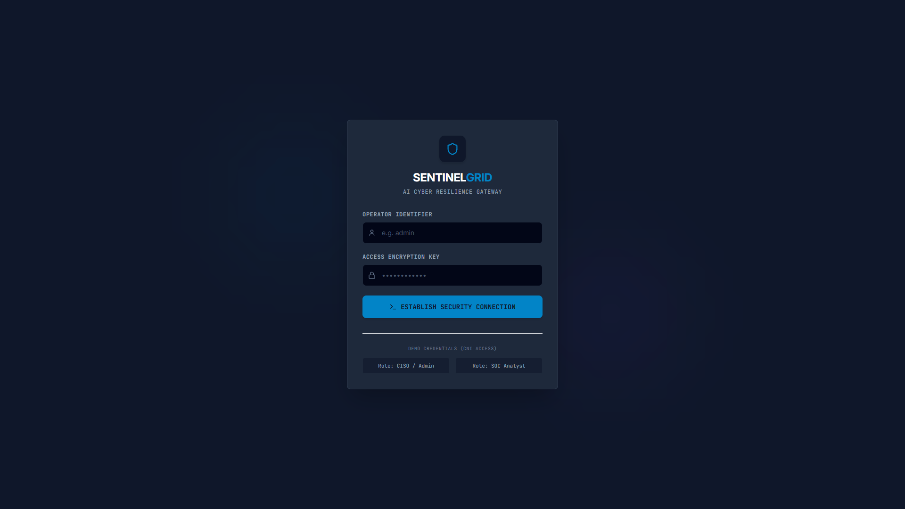
1. Login with default credentials:
   - **Username:** `admin`
   - **Password:** `admin123`
2. Once on the dashboard, click the **"Seed Threat Feed"** button in the top right corner.
3. This will instantly populate the platform with 50 simulated APT events so you can explore all features immediately!

---

## 📂 Directory Structure

```text
SentinelGrid AI/
├── backend/                  # FastAPI Backend API Server
│   ├── app/
│   │   ├── ai/               # AI & Machine Learning Engines
│   │   │   ├── anomaly_engine/    # Isolation Forest & Risk Scorers
│   │   │   ├── mitre_engine/      # MITRE ATT&CK TTP Mapping + Actor Similarity
│   │   │   └── threat_rag/        # ChromaDB Vector Store (CVE, OWASP)
│   │   ├── api/              # API Endpoint Routes & Schemas
│   │   ├── core/             # Redis Cache & JWT Auth Helpers
│   │   ├── services/         # Incident Playbooks, Simulation & Topology Engine
│   │   ├── database.py       # SQLAlchemy Connection Pooling
│   │   ├── models.py         # ORM Models
│   │   └── main.py           # API Entrypoint & Middleware
│   ├── Dockerfile
│   └── requirements.txt
│
├── frontend/                 # Vite + React SOC Dashboard
│   ├── src/
│   │   ├── components/       # Glassmorphic UI Components
│   │   ├── pages/            # Dashboard, Topology, RAG, Prediction Views
│   │   └── App.jsx
│   ├── Dockerfile
│   └── package.json
│
├── docker-compose.yml        # Backend, Frontend, Postgres, Redis, ChromaDB
├── docs/                     # Project screenshots and documentation
└── README.md
```

---

## 🛠️ Technology Stack

| Component | Tech Stack | Role / Purpose |
|---|---|---|
| **Frontend** | React, Vite, TailWind CSS, Chart.js, Vis.js | Real-time glassmorphic SOC dashboard and network maps |
| **App Server** | FastAPI, Uvicorn, Gunicorn | High-concurrency ASGI Python web server |
| **Relational DB** | PostgreSQL 15, SQLite fallback | Telemetry logging, incident tables, playbook records |
| **Vector DB** | ChromaDB | Semantic store for CVEs and OWASP threat intelligence |
| **Cache & Queue** | Redis 7 | Session sync, event processing, API rate limiting |
| **ML Engine** | scikit-learn, numpy, pandas | Isolation Forest and One-Class SVM |
| **Graph Engine** | ReactFlow + backend topology models | Lateral movement path visualisation and attack propagation |
| **Embeddings** | sentence-transformers | Air-gapped local embeddings for threat RAG |

---

## ⚙️ Environment Configuration

Copy `.env.example` to `.env`:

```bash
# Backend Connection Strings
DATABASE_URL=postgresql://sentinelgrid:sentinelgrid_secret@db:5432/sentinelgrid
REDIS_URL=redis://redis:6379/0

# Auth Secrets (generate a secure random string, min 32 chars)
JWT_SECRET_KEY=change-this-to-a-strong-random-string-at-least-32-chars

# Telemetry Integrations
TELEGRAM_BOT_TOKEN=
TELEGRAM_CHAT_ID=
```

---

## ⚡ Docker Quick Start (Production)

To run the application in a containerized environment (which spins up Postgres, Redis, and ChromaDB):

1. Copy `.env.example` to `.env` and configure your credentials.
2. Build and start all services:
   ```bash
   docker compose up --build -d
   ```
3. Verify all services are healthy:
   ```bash
   docker compose ps
   ```

| Service | URL |
|---|---|
| SOC Frontend | http://localhost:5173 |
| Backend API Docs | http://localhost:8000/docs |
| ChromaDB | http://localhost:8002/api/v1/heartbeat |

---

## 📄 License

This project is licensed under the MIT License — see the `LICENSE` file for details.
