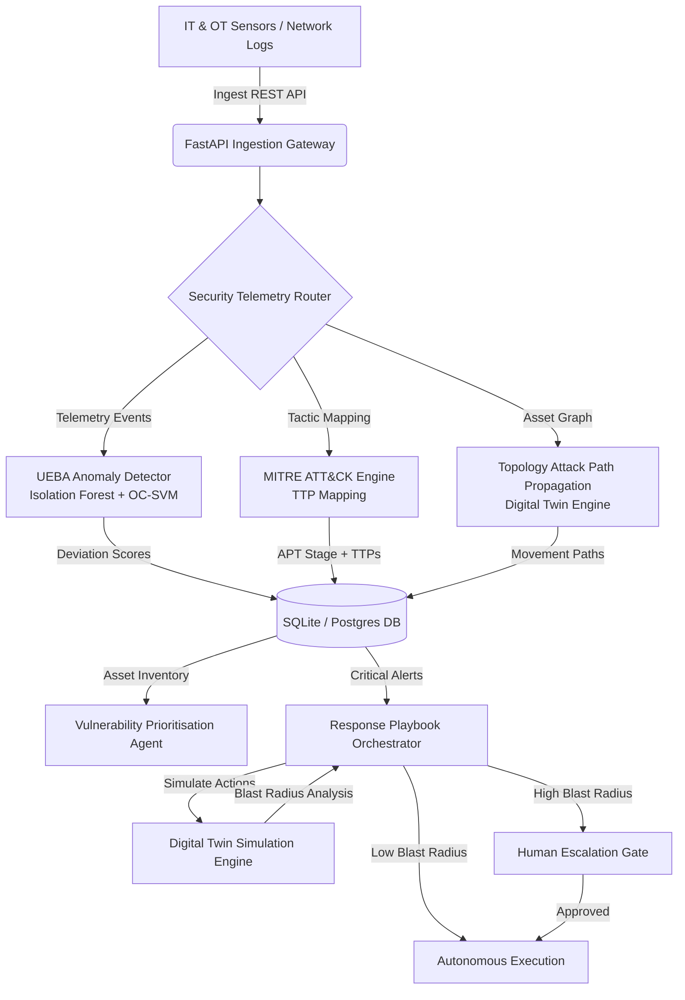

# 🛡️ SentinelGrid AI

### **AI-Powered Cyber Resilience Platform for Critical National Infrastructure**

[](#)
[](#)
[](#)
[](#)
[](#)

---

## 🚨 Problem Statement

India's critical national infrastructure is under sustained attack — and the defence gap is widening. Most public-sector organisations discover breaches only after significant damage has already occurred — weeks or months after initial infiltration. Advanced Persistent Threats (APTs) deliberately operate at low-and-slow speeds, specifically designed to evade signature-based detection.

**SentinelGrid AI** compresses the time from initial compromise to detection and response from **weeks to hours** by using a **behavioural intelligence layer** that detects anomalies from how systems *normally behave* — not from whether they match a known malware signature — across both IT and OT environments.

---

## 💡 Innovation Highlights & Key Features

SentinelGrid AI goes beyond traditional SIEM and SOC platforms by combining capabilities that are typically siloed across multiple enterprise products.

### 1. 🌐 Geopolitical Threat Origin Map
Visualize global APT campaigns and pinpoint where attacks are originating in real-time.


### 2. 🛡️ Active Security Incidents & Autonomous Response
Manage all active incidents in a unified queue. The **Autonomous Response Orchestrator** executes pre-approved containment within seconds, while requiring human escalation for high blast-radius actions.


### 3. 🧩 MITRE ATT&CK Matrix Mapping
Automatically maps observed behaviors to the MITRE ATT&CK framework, predicting the next stage of an APT campaign.


### 4. 🔮 Cyber Digital Twin & Blast Radius Simulation
Test attack path modeling and red team scenarios without touching live systems. Simulate the blast radius of containment actions before executing them.


### 5. ⚠️ CNI Patch Prioritization
Contextualizes CVEs against your specific network topology and observed threat actor profiles, highlighting the most critical vulnerabilities.


### 6. 🧠 Attack Predictions & UEBA Analytics
Utilizes User and Entity Behavior Analytics (UEBA) to detect anomalies. Machine learning models predict future attack vectors based on historical telemetry.


### 7. 🕵️ Threat Intelligence RAG
An integrated semantic search engine for threat intelligence. Ask questions about CVEs, APTs, and get actionable insights.


---

## 🚀 How to Start the Project (Local Development)

The project consists of a FastAPI Python backend and a React/Vite frontend. It uses SQLite for local development out of the box.

### Prerequisites
- Python 3.11+
- Node.js 18+ & npm

### 1. Backend Setup (FastAPI)
1. Open a terminal and navigate to the `backend` directory:
   ```bash
   cd backend
   ```
2. Create and activate a Python virtual environment:
   ```bash
   python -m venv .venv
   # Windows
   .venv\Scripts\activate
   # Linux/Mac
   source .venv/bin/activate
   ```
3. Install dependencies:
   ```bash
   pip install -r requirements.txt
   ```
4. Start the backend server:
   ```bash
   python -m uvicorn app.main:app --host 0.0.0.0 --port 8000
   ```

### 2. Frontend Setup (React/Vite)
1. Open a **new terminal** and navigate to the `frontend` directory:
   ```bash
   cd frontend
   ```
2. Install Node modules:
   ```bash
   npm install
   ```
3. Start the Vite development server:
   ```bash
   npm run dev
   ```
4. Open your browser and navigate to `http://localhost:5174`.

### 3. Log In & Seed Data

1. Login with default credentials:
   - **Username:** `admin`
   - **Password:** `admin123`
2. Once on the dashboard, click the **"Seed Threat Feed"** button in the top right corner.
3. This will instantly populate the platform with 50 simulated APT events so you can explore all features immediately!

---

## ⚙️ System Architecture




---

## 📄 License
This project is licensed under the MIT License.
