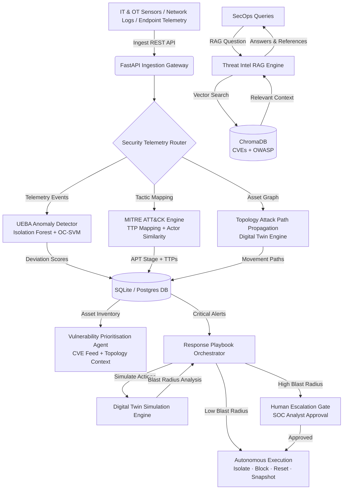

# 🛡️ SentinelGrid AI

### **AI-Powered Cyber Resilience Platform for Critical National Infrastructure**

[](#)
[](#)
[](#)
[](#)
[](#)
[](#)

---

## 🚨 Problem Statement

India's critical national infrastructure is under sustained attack — and the defence gap is widening. Most public-sector organisations discover breaches only after significant damage has already occurred — weeks or months after initial infiltration. Advanced Persistent Threats (APTs) deliberately operate at low-and-slow speeds, specifically designed to evade signature-based detection.

**SentinelGrid AI** compresses the time from initial compromise to detection and response from **weeks to hours** by using a **behavioural intelligence layer** that detects anomalies from how systems *normally behave* — not from whether they match a known malware signature — across both IT and OT environments.

---

## 💡 Innovation Highlights

SentinelGrid AI goes beyond traditional SIEM and SOC platforms by combining capabilities that are typically siloed across multiple enterprise products:

| Capability | What Makes It Different |
|---|---|
| **Behavioural Anomaly Detection** | Per-entity baselines for users, devices, and network segments — no signatures required |
| **APT Campaign Attribution** | MITRE ATT&CK TTP mapping with threat actor similarity scoring and next-stage prediction |
| **Autonomous Response Orchestrator** | Executes pre-approved containment within seconds; human escalation gates for high blast-radius actions |
| **Vulnerability Prioritisation** | Contextualises CVEs against your specific network topology and observed threat actor profiles |
| **Cyber Resilience Digital Twin** | Attack path modelling and red team scenario testing without touching live systems |
| **Threat Intelligence RAG** | Air-gapped semantic search over CVEs and OWASP — offline, no cloud dependency |

---

## 🚀 How to Run the Project (Local Development)

The project consists of a FastAPI Python backend and a React/Vite frontend. It uses SQLite for local development out of the box.

### Prerequisites
- Python 3.11+
- Node.js 18+ & npm
- (Optional) Docker for containerized deployment

### 1. Backend Setup (FastAPI)
1. Navigate to the `backend` directory:
   ```bash
   cd backend
   ```
2. Create and activate a Python virtual environment:
   ```bash
   python -m venv .venv
   # Windows
   .venv\Scripts\activate
   # Linux/Mac
   source .venv/bin/activate
   ```
3. Install dependencies:
   ```bash
   pip install -r requirements.txt
   ```
4. Start the backend server:
   ```bash
   python -m uvicorn app.main:app --host 0.0.0.0 --port 8000 --reload
   ```
   *The backend will automatically initialize the `sentinelgrid.db` SQLite database if it doesn't exist.*

### 2. Frontend Setup (React/Vite)
1. Open a new terminal and navigate to the `frontend` directory:
   ```bash
   cd frontend
   ```
2. Install Node modules:
   ```bash
   npm install
   ```
3. Start the Vite development server:
   ```bash
   npm run dev
   ```
4. Open your browser and navigate to `http://localhost:5173`.
5. Login with default credentials (if prompted):
   - **Username:** `admin`
   - **Password:** `admin123`

---

## 🛠️ Implementation Details & Advanced Usage

### Populating the Dashboard (Simulation)
When you first start the application, the database is empty. To populate it with data:
1. Open the **SentinelGrid AI Dashboard** in your browser.
2. Click the **"Seed Threat Feed"** button (cyan button in the top right corner).
3. The system will automatically inject 50 simulated telemetry events and multi-stage CNI campaigns.
4. The backend uses the `app.ai.threat_rag.embedding_engine` to correlate the data.
5. You can click this button multiple times to generate more data.

### Managing Data & Clearing Logs
The platform accumulates events and logs rapidly. You have two ways to clear data:
- **Soft Deletion (Recycle Bin)**:
  - From the UI, navigate to the **Active Incidents** page and click the red Trash icon to soft-delete all incidents.
  - From the **Audit Trail** page, click **CLEAR ALL LOGS** to soft-delete all telemetry.
- **Hard Deletion (Database Reset)**:
  - To permanently wipe all generated data (logs, incidents, audit trail, telemetry), run the cleanup script from the `backend` folder:
    ```bash
    cd backend
    python clear_all_logs.py
    ```
    *Note: This preserves your User and Organization records but wipes the simulation data.*

### The Simulation Engine & Thresholds
The `Seed Threat Feed` simulation actively adjusts your organization's anomaly threshold. 
- In `models.py`, the `Organization` table has an `anomaly_threshold` column (default 0.70).
- The `incidents.py` and `telemetry.py` routes actively read and adjust this threshold using Reinforcement Learning techniques. If a user flags an incident as a false positive, the threshold is raised to prevent similar alerts.

---

## ⚙️ System Architecture



---

## ⚡ Docker Deployment (Production)

To run the application in a containerized environment (which spins up Postgres, Redis, and ChromaDB):

1. Copy `.env.example` to `.env` and configure your credentials.
2. Build and start all services:
   ```bash
   docker compose up --build -d
   ```
3. Verify all services are healthy:
   ```bash
   docker compose ps
   ```

| Service | URL |
|---|---|
| SOC Frontend | http://localhost:5173 |
| Backend API Docs | http://localhost:8000/docs |
| ChromaDB | http://localhost:8002/api/v1/heartbeat |

---

## 📄 License

This project is licensed under the MIT License — see the `LICENSE` file for details.
